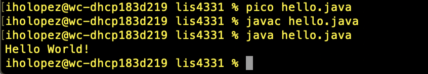
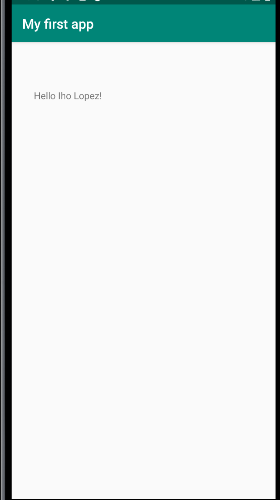
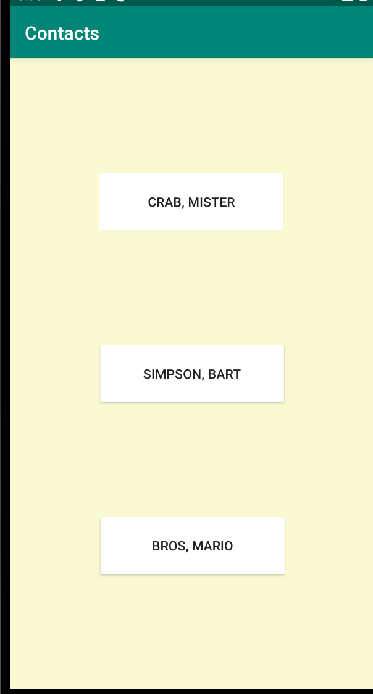
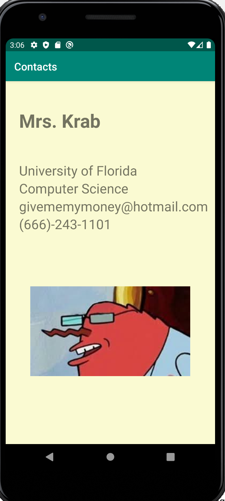

# LIS4331 Advanced Mobile Programming

## Iho Lopez Tobi

### Assignment 1

> #### Git commands with short definitions :

1. git init - Creates an empty Git repository.
2. git status - Displays paths that have differences between the index file and the current head commit.
3. git add -  Updates the index using the current content found in the working tree, to prepare the content staged for the next commit.
4. git commit - Create a new commit containing the current contents of the index and the given log message describing the changes.
5. git push - Updates remote refs using local refs, while sending objects necessary to complete the given refs.
6. git pull - Incorporates changes from a remote repository into the current branch.
7. One additional git command git-shell- This is a login shell for SSH accounts to provide restricted Git access.

| *Screenshot of running java hello:* | *Screenshot of First app:* |
| ----------- | ----------- |
|   |  |

| Contacts Picture | Contact 1 | Contact 2 | Contact 3|
| ----------- | ----------- | ----------- | ----------- |
||   | ||

#### Tutorial Link:

*Bitbucket Tutorial -Station Locations:*
[A1 Bitbucket Station Locations Tutorial Link](https://bitbucket.org/il16d/bitbucketstationlocations/ "Stations Locations")

