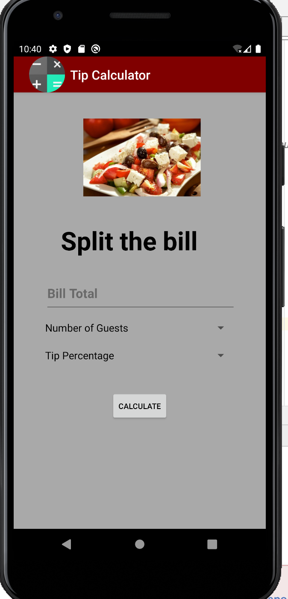
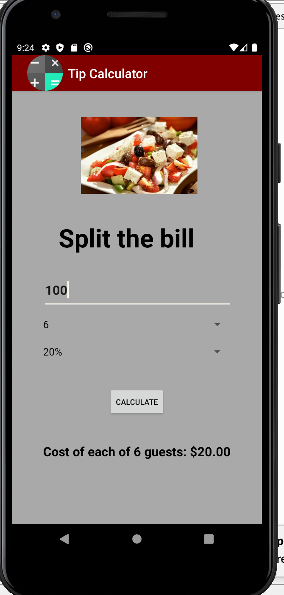

# LIS4331 Advanced Mobile Programming

## Iho Lopez Tobi

### Assignment 2

> #### Short definition :
For this app we had to make use of two spinners in order to determine the number of guests
and the tip amount to calculate the final bill. The input will come from the user using a input field.
And lastly the result will be displayed to the user in an updated text field after this presses the calculate button. 

*Tip calculator App*
 
| Not Populated App | App populated |
| ----------- | ----------- |
|   |  |

