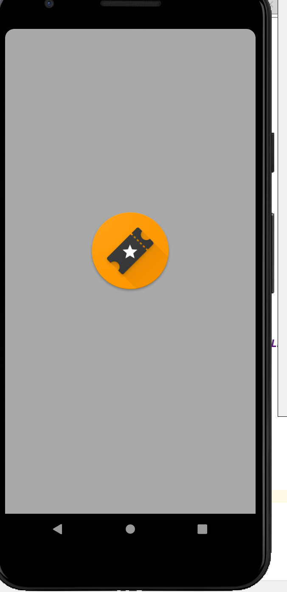
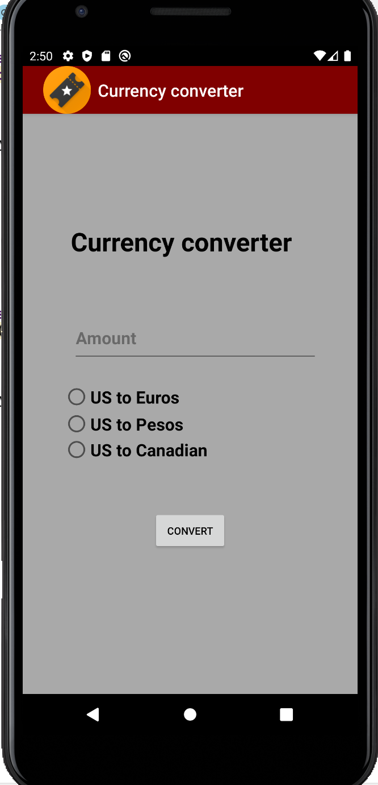
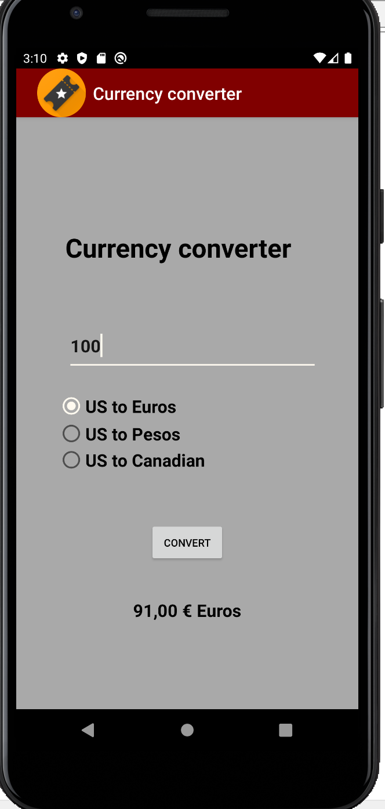
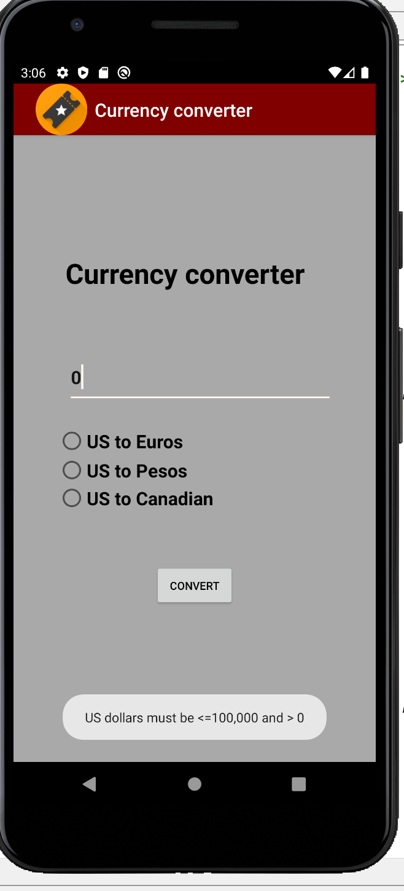

# LIS4331 Advanced Mobile Programming

## Iho Lopez Tobi

### Assignment 3

> #### Short definition :
For this app we had to make use of three radio Buttons in order to determine to which currency the user wanted to convert their entered value. The input come from the user using a input field.
And lastly the result is displayed to the user in an updated text field after this presses the convert button. 

*Currency Converter*
 
| Loading Screen Animation | Loading Screen | Not Populated App | App populated |Error Toast|
| ----------- | ----------- | ----------- | ----------- |----------- |
|   |  |   |  |  |

