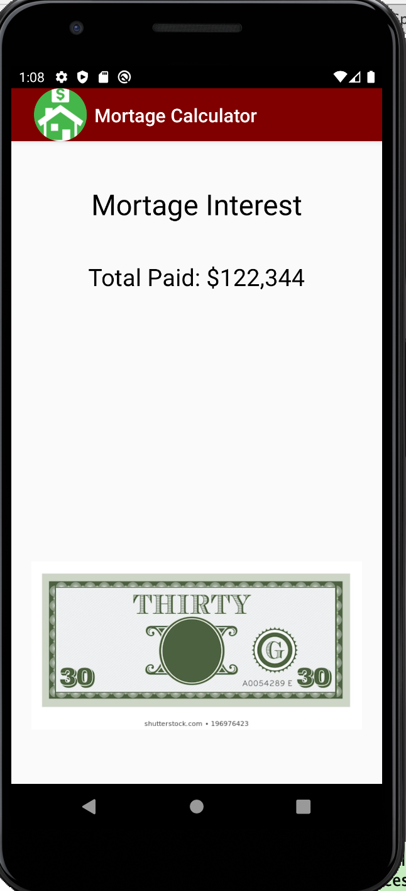

# LIS4331 Advanced Mobile Programming

## Iho Lopez Tobi

### Assignment 4

> #### Short definition :
For this app we had to create a mortage calculator. Essentially we requested the years to pay the mortage, the initial amount and the montly amount and we calculated how much would they had paid over the years imputed.

*Mortage Calculator*
 
| Loading Screen | Not Populated App| App populated | Result |Error|
| ----------- | ----------- | ----------- | ----------- |----------- |
|   |  |   |  |  |

