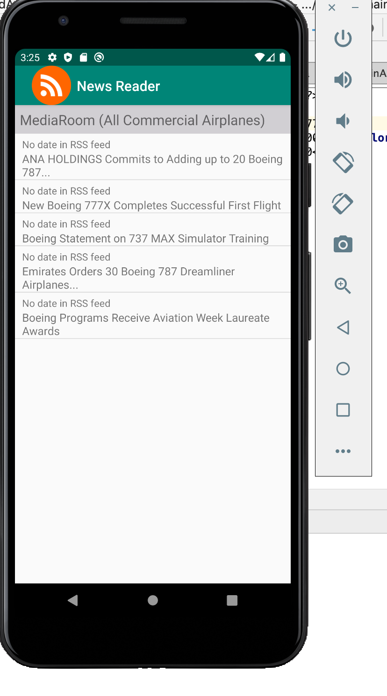
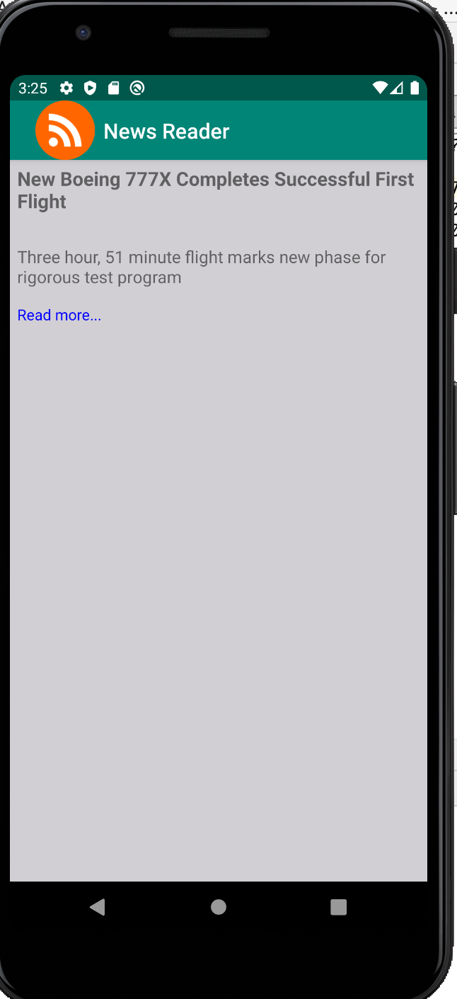
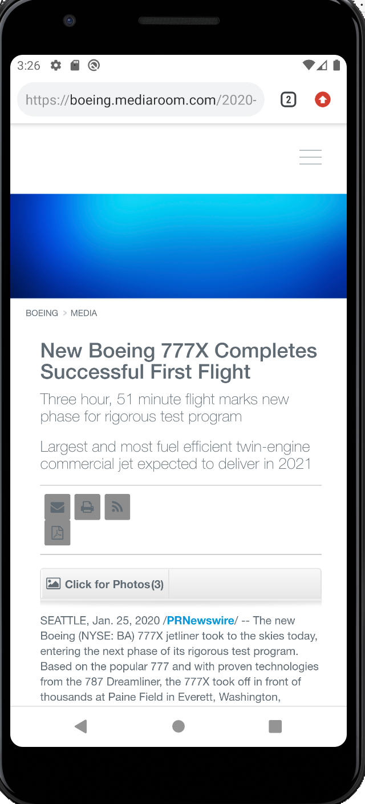

# LIS4331 Advanced Mobile Programming

## Iho Lopez Tobi

### Assignment 5

> #### Short definition :
This app is a news reader using RSS Feed to load all the news in the app and allow the user to enjoy updates on theyr own device.

*RSS Feed*
 
| Articles screen | Article | Web browser | 
| ----------- | ----------- | ----------- | 
|   |  |   | 

