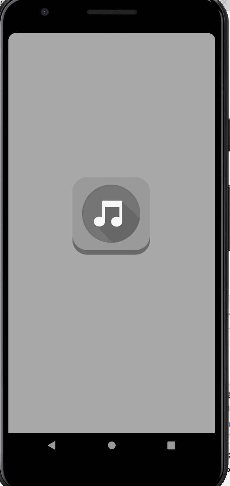
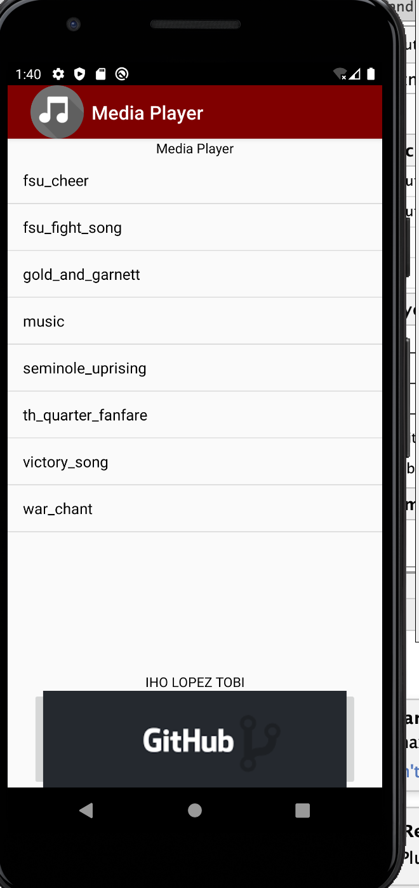
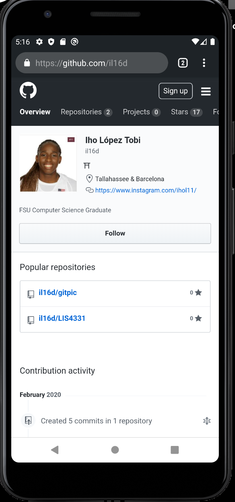
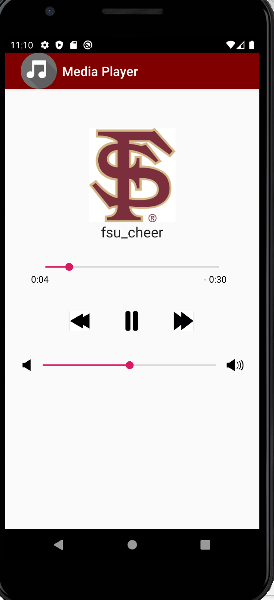
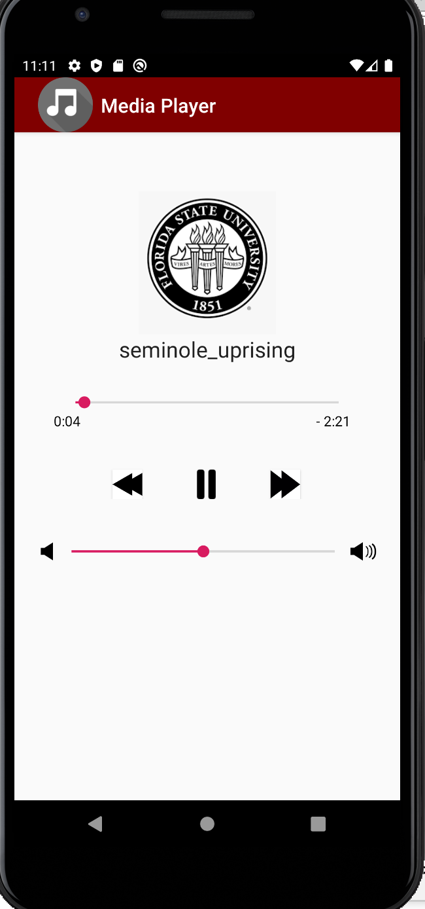

# LIS4331 Advanced Mobile Programming

## Iho Lopez Tobi

### Project 1

> #### Short definition :
For this app we had to create a media player. Essentially my app uses an array list to Display all the songs in the application and allows the user to click each item to then listen to the song. Once the user click the item an Activity gets launched loading the song where there are a play button, a foward and reverse button. An image also gets displayed with the song image along with a seek bar and volume bar.

*Media Player*

| Loading Screen | Array list | Github Page | Song |Another one|
| ----------- | ----------- | ----------- | ----------- |----------- |
|   |  |   |  |  |
